# zero-ecs-lib 当前架构设计

本文档描述当前代码的组织、所有权、生命周期和主要数据流，用于后续架构评审。图中实线表示当前已经存在的关系。

## 1. 总体分层

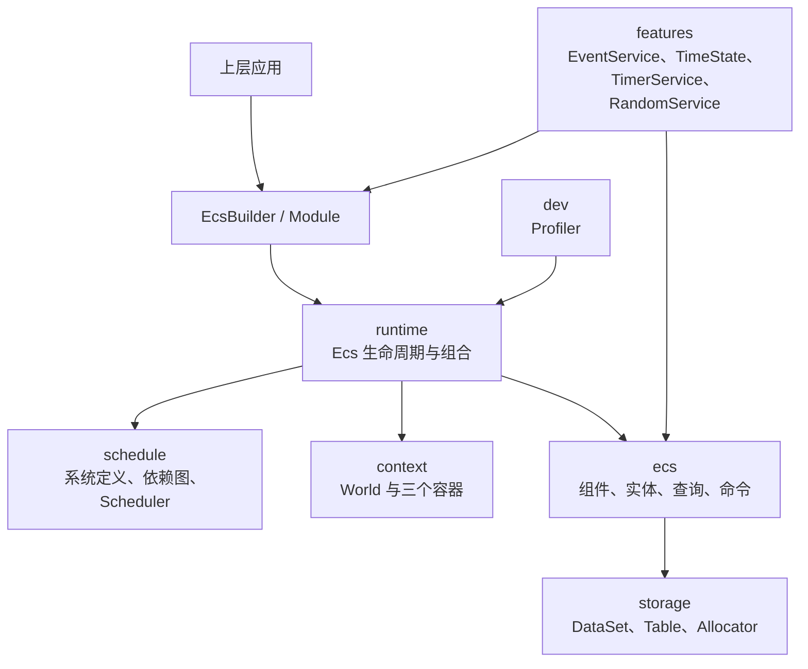

目录职责：

| 目录 | 当前职责 |
| --- | --- |
| `storage/` | TypedArray、2 MiB Block、16 KiB Chunk、DataSet/Table |
| `context/` | Resource/State/Service、属性注入、容器、World |
| `ecs/` | Component、Archetype、Entity、Query、Command、ECS 内存服务 |
| `schedule/` | Stage、System 参数、依赖关系、Scheduler |
| `runtime/` | Ecs、EcsBuilder、Module、生命周期 |
| `features/` | 可选的事件、时间、计时器、随机功能 |
| `internal/` | 不计划作为稳定 API 的复用实现 |
| `dev/` | 开发诊断工具 |

## 2. 运行时所有权

World、三个容器与 Scheduler 是 Ecs 下的同层对象，World 不拥有 Scheduler。

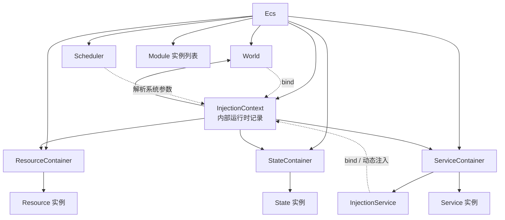

所有实例在 `EcsBuilder.build()` 中创建或收集。`InjectionContext` 是不对外公开的运行时记录，同时绑定到 World 与自动注册的 InjectionService；State、Service 以及后续创建的池化辅助对象统一通过 InjectionService 完成属性注入。

World 只提供三个容器的访问能力。动态对象注入只有 `InjectionService.inject()` 一个入口；它不接管目标对象生命周期，并通过弱归属记录拒绝对象跨 Ecs 注入。

## 3. Core ECS 服务关系

`CoreEcsModule` 由 `EcsBuilder` 自动安装。

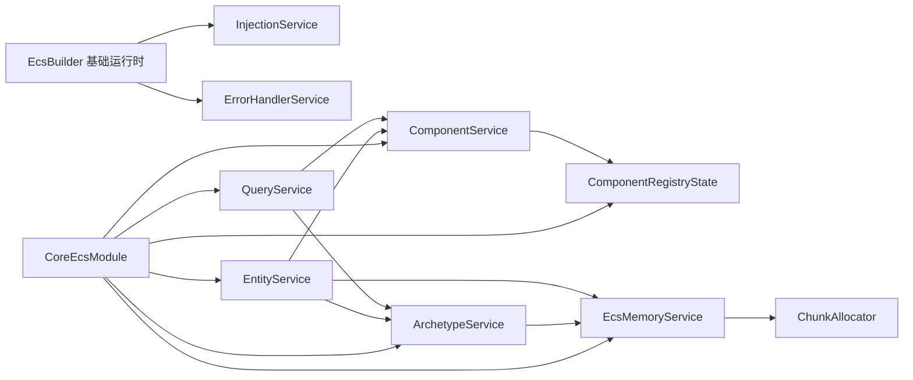

核心职责：

- ComponentService：World 内组件类到 ComponentMeta/ID 的唯一注册入口。
- EcsMemoryService：拥有当前 ECS 的 ChunkAllocator。
- ArchetypeService：按组件 Mask 查找和创建 Archetype。
- EntityService：管理带版本 Entity slot 和 Entity → ArchetypeRow 位置。
- QueryService：把静态 QueryType 实例化为绑定当前 World 的 Query。

## 4. 内存层级

```mermaid
flowchart TB
    Allocator["ChunkAllocator"] --> Block["2 MiB Block"]
    Block --> Chunks["128 × 16 KiB Chunk"]
    Chunks --> TableA["Table 0"]
    Chunks --> TableB["Table 1"]
    Chunks --> TableN["Table N"]

    subgraph TableLayout["每个 Table / Chunk 的 SoA 布局"]
        EntityColumn["Entity: Uint32Array"]
        PositionX["Position.x: Float32Array"]
        PositionY["Position.y: Float32Array"]
        VelocityX["Velocity.x: Float32Array"]
    end

    TableA --> TableLayout
    DataSet["DataSet"] --> TableA
    DataSet --> TableB
    DataSet --> TableN
    Archetype["Archetype"] --> DataSet
```

关键不变量：

1. Allocator 内部扩容单位固定为 2 MiB。
2. Allocator 对外分配单位固定为 16 KiB。
3. 一个 Table 精确占用一个 Chunk。
4. Table 所有列共享同一个 ArrayBuffer，通过 byteOffset 分区。
5. DataSet 使用 dense row 和尾行 swap-remove。
6. Archetype 的第 0 列固定保存 Entity，后续列按 ComponentMeta.layout 展开。

EntityService 自身也使用独立 DataSet 保存稳定 slot：Version、Archetype index、Table ID 和 Row。Entity 始终规范化为无符号 32 位值；generation 耗尽时退休 slot，避免旧句柄回绕复活。

## 5. Component 注册与 Archetype 构建

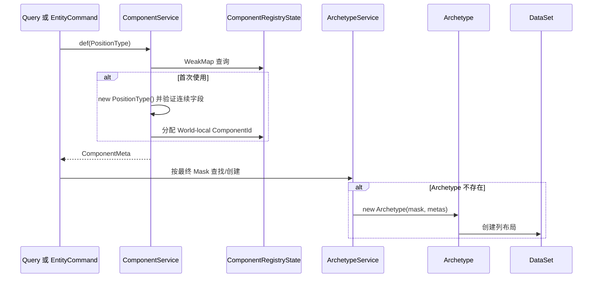

组件类是跨 World 的稳定 token；Mask bit 和 ComponentId 都只属于当前 ECS。

## 6. Query 构建与遍历

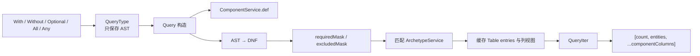

Query 缓存通过两种版本失效：

- `ArchetypeService.version`：Archetype 集合发生变化。
- `DataSet.version`：某个匹配 Archetype 创建或释放 Table。

QueryIter 每次返回一个 Table，而不是一个 Entity，因此系统内层循环可以直接遍历连续 TypedArray。

## 7. EntityCommand 延迟结构变更

```mermaid
flowchart LR
    System["用户系统"] --> Manager["CommandService.entity/spawn"]
    Manager --> Writer["池化 EntityCommand"]
    Writer --> Ops["add / set / remove / despawn"]
    Ops --> Submit["submit → 统一 Command 队列"]
    Submit --> Flush["CommandService.flush<br/>Internal Post"]
    Flush --> Plan["EntityMigrationService.record<br/>合并 MigrationPlan"]
    Plan --> Migrate["Migration Post<br/>EntityService.migrate"]
    Migrate --> Target["最终 Archetype / DataSet"]
```

EntityCommand 与普通 Command 使用同一队列和对象池。`spawn()` 立即预留 Entity ID；同一 Post 周期内每个 Entity 只有一个 MigrationPlan，并按“迁移、清零、最终字段写入”提交。

当前 `CommandModule` 的顺序：

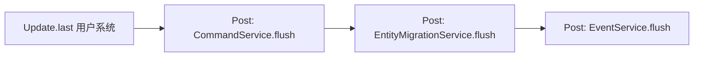

Post 使用不从公共入口导出的内部阶段分区，顺序固定为 Command、Migration、Event；普通业务系统只能注册 `first/fixed/last`。

## 8. System 注册与调度

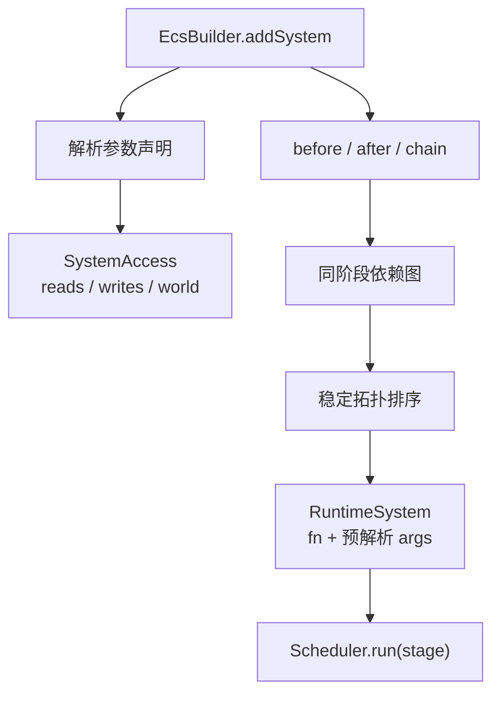

当前 Scheduler 是串行执行器。SystemAccess 已记录 Resource/State 访问，但尚未自动生成冲突依赖，也没有并行批次。

系统参数解析发生在 `Scheduler.init()`：

| 注册项 | 运行时参数来源 |
| --- | --- |
| `World` | InjectionContext.world |
| Resource 类型 | ResourceContainer |
| State 类型 | StateContainer，记录为 read |
| `Write(StateType)` | StateContainer，记录为 write |
| Service 类型 | ServiceContainer |
| QueryType | QueryService.create(QueryType) |

## 9. 生命周期与时序

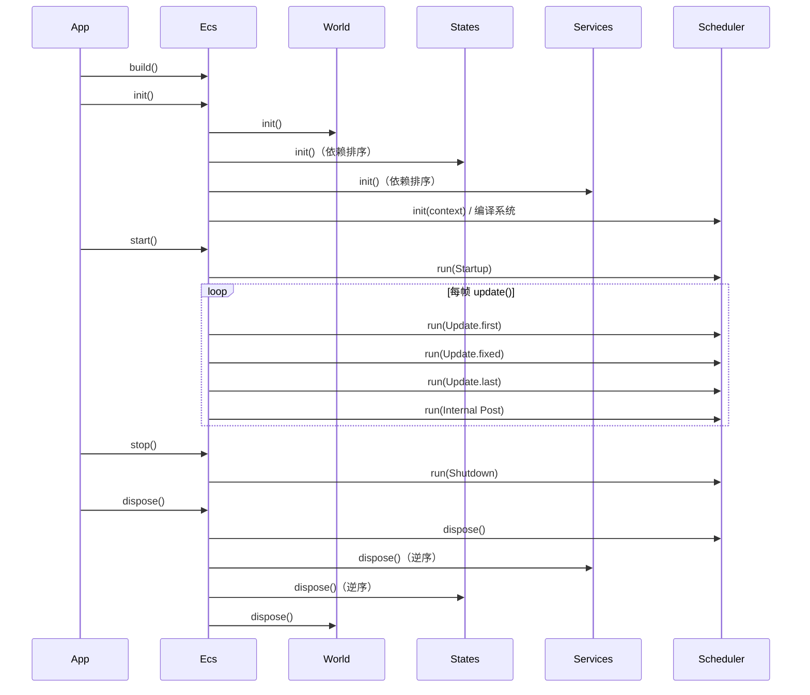

Core Service 按依赖逆序释放：EntityService 先释放 slot DataSet，ArchetypeService 再释放全部 Archetype DataSet，最后 EcsMemoryService 校验并清空 ChunkAllocator。正常 dispose 后不保留已分配 Chunk 或 2 MiB Block。

一次 `ecs.update()` 有意表示一个固定模拟 Tick。TimeModule 通过 FixedTimeResource 推进 TimeState；真实时间累积、多次追帧和表现插值由上层引擎负责。

如果任意业务 System 或内部阶段抛错，本 Tick 立即失败，Ecs 自动 stop 并进入 Stopped；剩余 Post 不再执行，也不能再次 update。调用方随后 dispose 时，Command/Event/Migration 的 pending 工作只回收或取消，不会在另一个 Tick 重放。Command、Event、Timer 内部能够安全回收的任务错误则统一交给 ErrorHandlerService。

## 10. Module 组合

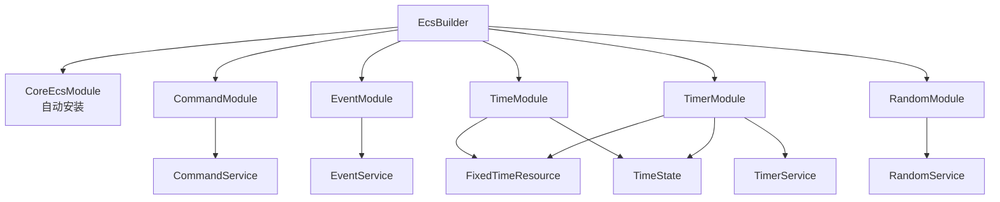

Module 在 build 阶段注册类型和系统，并作为运行时实例由 Ecs 持有。

### 10.1 Module 生命周期

Module 可以使用以下可选钩子管理 DOM 监听器、Worker、网络连接等 ECS 容器之外的资源：

```ts
interface Module {
    build(builder: EcsBuilder): void;
    init?(ecs: Ecs): void;
    start?(ecs: Ecs): void;
    stop?(ecs: Ecs): void;
    dispose?(ecs: Ecs): void;
}
```

建议时序：

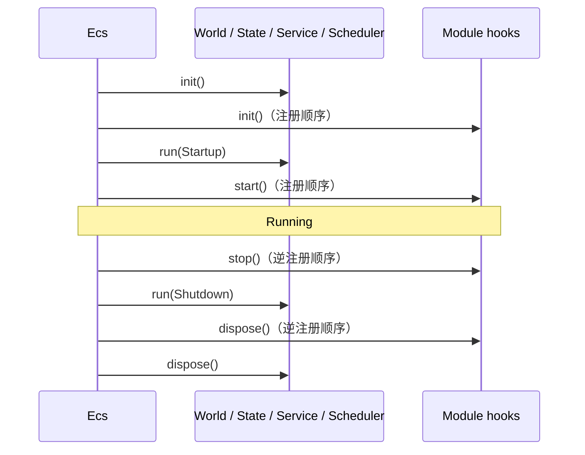

约束建议：

- 每帧行为继续使用 System，不给 Module 增加 update。
- ECS 内部初始化优先使用 State/Service.init 和 Startup System。
- ECS 内部清理优先使用 Shutdown System 与 State/Service.dispose。
- Module hook 只处理 Module 自己持有的外部句柄或跨服务协调。
- hook 保持同步；若未来需要异步生命周期，应单独设计异步 Ecs API。
- EcsBuilder 保存 Module 实例并传给 Ecs；同一实例重复注册会被拒绝。

## 11. 已确定的边界与延期项

以下关系已经在代码中确定；延期项不会阻塞当前串行纯数据运行时。

### 11.1 稳定入口与 Advanced 入口

`zero-ecs-lib` 只导出 Runtime、Component/Entity/Query、Command、System 和可选 Module。`zero-ecs-lib/advanced` 导出 Allocator、DataSet、Mask、Archetype、容器和 DevProfiler。InternalPost 与 EntityMigrationService 两个入口都不导出。

### 11.2 EntityCommand 事务合并

EntityMigrationService 使用 World-local Map 定位池化 MigrationPlan；Command Post 只收集最终状态，Migration Post 保证每个 Entity 最多迁移一次。该内部 Service 不从根入口导出。

### 11.3 Post 提交屏障

CommandService flush 已从 `Update.last` 移入内部 Post。业务系统无法从公共入口取得内部 token，所有结构提交发生在业务阶段结束之后。

### 11.4 延期的权限图

- State 的 read/write 已记录但未用于冲突边。
- Query 没有组件读写声明。
- World 是不透明访问，但当前不会阻止任何排序或并行。
- Resource 的只读意图尚未完全反映到系统函数 TypeScript 参数。

### 11.5 GC 与分配边界

- Command 队列、EntityCommand 指令数组和对象池按高水位复用。
- flush 后保留的 Command 不能再次使用；对象池后续可能复用同一实例。
- QueryIter 和 current tuple 复用。
- Query rebuild 使用 Map、Set 和数组，发生结构变化时会重新分配缓存。

完整静态审计见[性能与分配模型](./performance.md)。

## 12. 后续独立评审顺序

1. 设计 Query 的读写访问语法，并接入 SystemAccess。
2. 在决定并行执行后，再设计冲突批次和调度策略。
3. 基于明确数据评估 Migration Map、数字编码位置和 Query rebuild 缓存。
4. 独立评审深层 Readonly、Boolean 列和异步 Module 生命周期。
5. 出现 Editor/Prefab 需求时再设计 EntityTemplate，不在纯运行时提前加入批量模板抽象。
