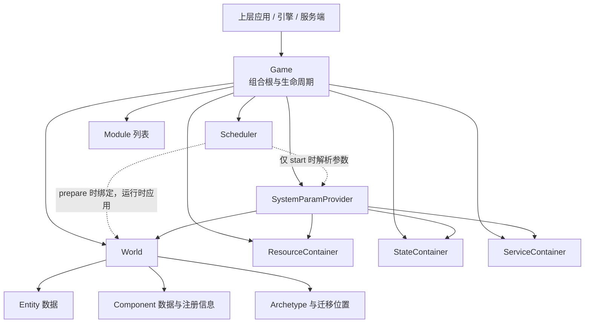
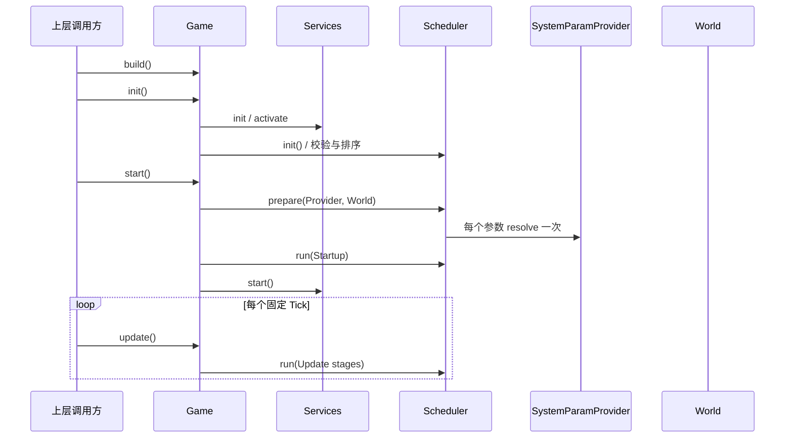

# Game / World 框架调整方案

> 状态：设计方案，已根据架构评审修订，尚未实施。阶段 A1 已批准独立推进，阶段 A2 与阶段 B 已批准同步实施；阶段 C 已确定 WorldView/StructureWriter 类型分层、EntityService 兼容、实体读取 API 分类和 internal 编译期窄接口。Framework v1 的 WorldView 只纳入能独立完成实体访问的 `valid/get/has`，编码前须固定 Node benchmark 并建立核心基线，发布前再完成 Chromium 与 Tick 尾延迟门槛。
>
> 基线：以当前 `Ecs`、`World`、`Scheduler`、三个依赖容器和 Core ECS Service 的实现为准。
>
> 范围：只调整框架职责、所有权、依赖方向和生命周期时点；不重新设计 Entity、Component、Archetype、Query、Command、Migration、DataSet、Allocator 或对象池的实现。

## 0. 决策优先级

正确性是不可交换的底线。在此基础上，本方案遵守项目统一的性能与分配原则，完整定义见 [性能与分配模型](./performance.md)：

1. **执行性能第一**：优先保证游戏稳定 Tick 的吞吐、帧时间、尾延迟、缓存友好性和低调用开销。
2. **GC 稳定性第二**：在不显著损害执行性能的前提下，热路径追求稳定工作集下零显式分配，非热路径尽量减少不必要分配和引用滞留。
3. **架构抽象和安全防误用服从前两项**：职责边界、facade、writer 和类型能力协议不能给 Scheduler、Query、组件访问或批量结构提交增加未经证明的永久成本。

本方案据此采用以下具体规则：

- Scheduler 的逐 System 调用、Query 迭代、TypedArray 字段访问和 Internal Post 批量提交属于热路径；不增加临时对象、闭包、逐项 context/capability、容器查询或未经基准证明的转发层。
- 结构使用协议是“安全默认值 + advanced unsafe 逃生口”，不是不可绕过的权限系统；不能为了强制隔离污染热路径。
- build、init、start、stop、dispose、拓扑排序和参数 prepare 属于冷路径；允许简单、生命周期明确的临时分配。
- 冷路径不得仅为减少少量分配而引入对象池、高水位缓存、复杂 reset 状态、全局 registry 或额外所有权协议。
- 热路径可以采用经正常 JIT、`--jitless`、Tick 延迟和 GC 数据证明有效的复用结构；冷路径 GC 优化只接受同样简单的改写或有明确数据支持的方案。
- 如果抽象一致性、零分配方案与执行性能发生冲突，以整体游戏运行性能为准；如果更高的平均吞吐造成不可接受的 GC 尾延迟，则它也不属于整体性能更优。

### 0.1 约束表达层级

能由 TypeScript 类型系统、泛型映射、readonly 视图、非导出接口或模块边界表达的约束，必须优先在编译期表达，不得为了抵抗类型断言、反射或深路径导入而重复加入运行时检查。约束按以下顺序选择：

```text
1. TypeScript 类型约束
2. Builder / build / start 冷路径校验
3. 类型系统无法知道的必要运行时校验
4. 热路径运行时检查——仅在无法由前三层表达且有基准证明时允许
```

编译期约束是使用协议，不是安全沙箱。调用方通过 `as`、`any`、反射或非公开深路径绕过后自行承担结果，框架不在热路径增加第二套权限系统。

当前直接应用：

- `World` SystemParam 在类型层映射为非结构 `WorldView`，运行时仍传同一个 World 实例。
- State 参数映射为 `Readonly<State>`，`Write(State)` 映射为 `Mut<State>`；不在字段访问时检查权限。
- `InternalStructureAccess` 是不导出的编译期窄接口，当前由 EntityService 直接满足；不创建 runtime capability。
- Service API 自己表达可变能力，Scheduler 不为 Service 创建读写包装。
- `SystemAccess` 继续只是排序和冲突分析元数据，不成为运行时访问控制器。

### 0.2 运行时检查边界

只有编译期无法确定的信息才进入运行时检查：

| 类别 | 合理检查 |
| --- | --- |
| 生命周期 | init/start/prepare 是否重复或处于错误阶段，update 是否 Running，prepare 失败，dispose 后访问 |
| 实例归属 | World 是否已绑定其他 Game，Backend attach/detach 状态，Provider/World/Game 是否属于同一实例 |
| 动态数据 | Entity 版本、Component 存在性、Table/row 有效性、字段索引、DataSet 是否释放 |
| 外部输入 | Resource/Module 动态配置、用户数字范围、Snapshot 数据合法性 |

生命周期、实例归属和外部输入优先在 build/start 等冷路径检查。动态数据校验属于算法语义；若位于极热路径，仍需根据 API 契约和 benchmark 决定最小实现。任何进入 Scheduler、Query、组件字段访问或批量结构提交热路径的额外检查，都必须先证明无法由类型设计替代。

## 1. 背景与结论

当前 `World` 不是实体世界，而是绑定 `InjectionContext` 后访问 Resource、State、Service 的门面；真正持有 World、三个容器、Scheduler、Module 和生命周期的是 `Ecs`。Scheduler 在 `init()` 中直接识别所有参数类型，从 `InjectionContext` 取得参数并缓存到 `RuntimeSystem.args`。

目标框架采用以下定义：

- `Game`：ECS 模拟的组合根和运行时实例，是依赖注入、Module 和生命周期的所有者；它可以持有 DOM、Canvas 等宿主 Resource 或 Service，不要求自身是纯数据对象。
- `World`：纯实体数据集合，提供实体与组件的基础操作，不提供依赖注入和调度能力。
- `Scheduler`：应用于 World 的系统执行器，与 World 同级，不拥有 World。
- `SystemParamProvider`：Game 提供给 Scheduler 的系统参数来源接口；Scheduler 不依赖 Game、`InjectionContext` 或具体容器。
- System 参数在 `Game.start()` 中解析一次并缓存，任何 `update()` 都不得重新查询 Provider 或容器。

目标所有权如下：



所有权约束：

```text
Game owns World
Game owns Scheduler
Game owns DI containers and Modules
Scheduler does not own World
World does not own Scheduler
World does not know Game or DI
```

上图表达最终目标。阶段 A 至 C 中，Game 只拥有 World 门面对象及其绑定生命周期，实体数据仍物理存放在当前 Core State/Service 中；只有阶段 D 完成后，才能声称 World 物理拥有实体数据和独立释放能力。

## 2. 当前代码基线

本方案依赖并保留以下现状。

### 2.1 当前所有权

`EcsBuilder.build()` 当前执行：

1. 创建并锁定 Resource、State、Service 容器。
2. 创建包含 World 和三个容器的 `InjectionContext`。
3. 将 Context 绑定给 World 与 `InjectionService`。
4. 为 State、Service 完成属性注入。
5. 从 `SystemScheduleBuilder` 构造 `Scheduler`。
6. 将上述对象交给 `Ecs` 统一管理生命周期。

当前 `Ecs` 与 `World` 都提供 `resource()`、`state()`、`service()`；World 的三个方法只是转发给 Context 中的容器。

### 2.2 当前 Scheduler 已经具备的性能特征

当前 Scheduler 不是每帧解析系统参数。`Scheduler.init(context)` 会：

1. 按 Stage 筛选 SystemDefinition。
2. 对同阶段系统执行稳定拓扑排序。
3. 调用 `resolveParam()` 解析每个参数。
4. 把参数冻结并保存为 `RuntimeSystem.args`。

`Scheduler.run()` 只遍历已排序的 RuntimeSystem，并使用 0 至 8 参数的固定调用分支；超过 8 个参数才使用 `apply()`。

因此本方案不重写运行热路径，只做两项框架调整：

- 参数解析时点由 `Ecs.init()` 移到 `Game.start()`，并保证在第一个 Startup System 前完成。
- 将 `Scheduler.resolveParam()` 中对 `InjectionContext` 和具体类型的识别移到 `SystemParamProvider`。

### 2.3 当前实体能力的物理位置

当前实体数据和操作分布在 Core ECS 的 State 与 Service 中：

| 当前对象 | 当前职责 | 目标框架中的归属 |
| --- | --- | --- |
| `ComponentRegistryState` / `ComponentService` | 组件注册和 World-local ID | World 实体内核 |
| `ArchetypeState` / `ArchetypeService` | Archetype 集合、索引和版本 | World 实体内核 |
| `EntityState` / `EntityService` | Entity slot、位置和基础实体操作 | World 实体内核 |
| `QueryService` | 将 QueryType 实例化为当前实体世界的 Query | World 实体能力；首轮保留现有实现 |
| `EcsMemoryService` | Allocator 生命周期 | 继续保留为 Service；本方案不调整 Allocator 实现 |
| `EntityMigrationService` | 合并并提交延迟结构事务 | 继续作为 Game 的内部 Service/System 能力 |
| Command/Event/Timer 等 | 延迟行为和功能设施 | Game 的 State、Service 和 System |

“目标归属”描述的是最终框架职责，不授权在首轮重写这些类的存储结构和算法。

## 3. 核心职责

### 3.1 Game

`Game` 替代当前 `Ecs` 的顶层定位，但它不是完整的窗口、UI 或操作系统应用。它是 ECS 模拟的组合根和运行时实例，可以通过 Resource、Service 和 Module 接入 Canvas、输入设备、渲染器等宿主能力。上层应用也可以同时拥有多个 Game，例如主模拟、预览模拟或服务端房间。

Game 负责：

- 构建并持有一个 World。
- 构建并持有一个 Scheduler。
- 持有 Resource、State、Service 容器。
- 提供依赖注入能力和 Service 生命周期上下文。
- 组装 `SystemParamProvider`。
- 为宿主提供显式 StructureWriter 取得入口，但不把 Game/StructureWriter 注册为 SystemParam。
- 管理 Module 及 init/start/update/stop/dispose 生命周期。
- 在 start 阶段让 Scheduler 对当前 World 完成一次性准备。

建议命名映射：

| 当前名称 | 目标名称 |
| --- | --- |
| `Ecs` | `Game` |
| `EcsBuilder` | `GameBuilder` |
| `EcsPhase` | `GamePhase` |
| `ECS_CONSTRUCTION_TOKEN` | `GAME_CONSTRUCTION_TOKEN`（内部） |

发布兼容策略必须在阶段 B/C 前确定，不能等到类型和语义已经修改后再决定，具体门槛见第 8 节。

### 3.2 World

World 的最终目标是纯实体数据集合，只公开或承载以下能力：

- Entity 创建、销毁、有效性检查和位置管理。
- Component 注册信息与组件数据。
- Component 添加、删除、读取和修改。
- Entity 在 Archetype 之间的迁移。
- Archetype、Table、DataSet 和 Query 所需的实体元数据。
- 阶段 D 完成后，释放自身实体数据所需的清理能力。

World 不负责：

- Resource、State、Service 的访问或注入。
- Module 构建与生命周期。
- System 注册、排序和执行。
- Scheduler 所有权。
- Game 的 init/start/update/stop。
- DOM、Canvas、设备句柄等宿主能力。

当前下列入口应从目标 World 中移除：

```ts
World.inject();
world.resource(Type);
world.state(Type);
world.service(Type);
world.bind(injectionContext);
```

World 继续使用 `[World]` 作为 System 参数描述，但系统函数在编译期只接收非结构视图：

```ts
export interface WorldView {
    valid(entity: Entity): boolean;
    get<T extends object, Field extends ComponentFields<T>>(
        entity: Entity,
        type: ComponentType<T>,
        field: Field,
    ): number | null;
    has<T extends object>(entity: Entity, type: ComponentType<T>): boolean;
}

export interface StructureWriter {
    reserveEntity(): Entity;
    despawn(entity: Entity): boolean;
    // materialize/add/remove 的稳定签名仍按第 3.3.3 节单独评审。
}
```

- `WorldView` 是稳定根入口可导出的只读/非结构能力接口；阶段 C 只承诺能独立完成实体访问的 `valid/get/has`，不提供 reserve、despawn、materialize、组件增删或 Archetype 迁移。
- 当前 `EntityService.view()` 返回实体所在整张 Table 的组件列，必须再结合 `getCompLocation().row` 才能定位实体；它不是完整的单实体访问 API，因此不进入 Framework v1 的 `WorldView`。批量字段访问继续使用 Query。
- 这里的“只读”指 WorldView 本身不提供结构修改或 DI 能力，不表示其他组件访问 API 全部不可写；Query 和组件字段的可写性继续遵守现有 API 与 SystemAccess 调度规则。
- `SystemParamValue<typeof World>` 映射为 `WorldView`；Provider 运行时仍返回同一个 World 实例，不创建 view wrapper。
- `Game` 和 `StructureWriter` 不属于普通 `SystemParam`。宿主通过 `game.structureWriter()` 显式取得即时结构能力。
- 通过 `as World`、`any` 或反射绕过 `WorldView` 不属于框架防御范围。
- World 作为 System 参数不意味着 World 自己拥有 DI；参数映射和实例提供都属于 Game。

### 3.3 结构变更使用协议

World 提供实体基础操作，不代表即时结构变更在任意时点都安全。当前 Query 按 Table 复用迭代器，`EntityService.despawn()` 和 `migrate()` 会立即 swap-remove 或移动 DataSet 行；在 Query 遍历期间调用可能漏实体、重复实体或使已取得的 Table view、组件列引用失效。

Framework v1 采用“编译期安全默认值 + 显式低层逃生口”，而不是权限隔离。普通 System 的 `WorldView` 在类型上不提供结构方法；调用方显式取得 StructureWriter、注入 EntityService 或导入 advanced unsafe API 后自行承担结构时点责任。框架不承诺阻止反射、类型断言或其他越界手段。

现有 `Read/Write` access、WorldView 和 StructureWriter 分层都属于调度元数据或使用协议，不构成运行时安全边界。

| 入口 | 主要约束 | 延迟 | 性能定位 |
| --- | ---: | ---: | --- |
| WorldView 的 `valid/get/has`、Query 和已存在组件字段访问 | 编译期非结构视图；无逐调用权限检查 | 否 | 读取与字段写入热路径 |
| `CommandService` / `EntityCommand` | 无逐实体权限检查 | 是 | 普通 System 的推荐结构路径 |
| `StructureWriter` | 由宿主显式取得；默认不检查 executing | 否 | 宿主即时管理路径 |
| `InternalStructureAccess`（仅类型） | 无；运行时对象就是 `EntityService` | 否 | Internal Post 批量提交热路径 |
| `UnsafeStructureWriter` | 无；调用方显式选择 | 否 | advanced 性能与特殊需求 |
| 公开 `EntityService` | 无 | 否 | 兼容现有低层直接能力；显式使用即自行承担风险 |

普通 Startup、Update 和 Shutdown System 通过 `[World]` 只取得 `WorldView`，结构变更默认使用 Command。Startup 也不自动成为 Query 迭代安全点；确实需要即时能力的 System 必须显式注入低层 `EntityService` 或通过类型断言选择 advanced 路径，这属于主动逃生，不进行结构时点检查。宿主则在安全时点通过 Game 取得 StructureWriter。

```ts
// 推荐路径：延迟到既有 Internal Post。
commands.entity(entity).despawn().submit();

// 宿主已确认处于安全点；默认不做 executing 检查。
const writer = game.structureWriter();
writer.despawn(entity);

// 高级路径：不检查结构时点，调用方承担全部后果。
import { unsafeStructureWriter } from "zero-ecs-lib/advanced";
const unsafe = unsafeStructureWriter(world);
unsafe.despawn(entity);
```

不增加 Startup 后的强制 Command → Migration → Event 提交屏障。生命周期和现有延迟语义保持为 `Startup → Service.start → Module.start → 第一次 Update → Internal Post`。Startup Command 默认在第一次 Internal Post 物化；若实体必须在第一个 Tick 前存在，调用方可以显式使用 unsafe writer。若这种需求成为常态，再单独设计只负责初始化物化的批量 writer，不能复用完整 Command/Event 队列并改变监听器时序。

#### 3.3.1 结构写路径分层

阶段 C 将结构写内核与入口策略分开：

```text
System [World] --> WorldView ------- non-structural access
game.structureWriter() ------------> StructureWriter -------------┐
Built-in Command / Internal Post ---> EntityService --------------┼--> unchecked structure kernel
zero-ecs-lib/advanced --------------> UnsafeStructureWriter ------┤
公开 EntityService -----------------> direct unchecked -----------┘
```

- WorldView、StructureWriter、internal、unsafe 首先描述编译期能力边界，不要求为了形式对称而创建运行时对象。writer 是否实体化、何时缓存必须由调用频率和 benchmark 决定。
- Framework v1 的 internal 能力只定义为编译期窄接口，当前 `EntityService` 直接实现它：

```ts
/** @internal 仅约束内建批量提交所需的最小方法集合。 */
type InternalStructureAccess = Pick<EntityService, "valid" | "migrate" | "despawn">;
```

- `valid` 是当前 `MigrationPlan.flush()` 在 migrate 前执行的句柄校验，`despawn` 供内建实体命令直接提交销毁。`MigrationPlan.flush(access)` 接收的实际对象仍是 `EntityService`；类型收窄不会创建 wrapper，也不会增加一次转发调用。
- Internal Post 不创建 internal writer、不取得或验证 token，也不维护 capability 生命周期。阶段 D 将实体数据迁入 World 后，可以让新的具体内核实现同一窄接口。
- StructureWriter 只通过宿主 `game.structureWriter()` 显式取得；实现可以返回同一个 World/实体内核对象的窄类型视图，也可以使用一个简单稳定对象，但不能仅为避免冷路径的一次分配引入 registry、对象池或复杂 lazy 状态。
- StructureWriter 与 UnsafeStructureWriter 默认都不检查时点；区别在于前者是稳定、经过评审的宿主结构 API，后者位于 advanced 子路径并可以暴露更低层、兼容性承诺更弱的操作。
- unsafe writer 若进入游戏批量热路径，调用方应在循环外取得并复用；若只是偶发工具或加载操作，允许简单地创建一次临时 writer。框架不为消除这类冷路径分配强制维护全局 WeakMap 或跨 Game 缓存。
- 不使用 Proxy，也不把创建闭包式 scope 作为唯一入口；任何进入稳定 Tick 的 writer 必须在循环外取得，Tick 内不创建 writer、scope、token 或临时数组。
- Framework v1 默认不维护 executing 状态，StructureWriter 不读取调度阶段；`valid/get/has`、Query、组件字段访问和 EntityService 都没有新增权限检查。
- Scheduler 的 `run()`、`invoke()` 和逐 System 调用前后不切换结构状态，也不增加 `try/finally`。
- StructureWriter、EntityService/内部窄接口与 unsafe writer 直接调用 unchecked 结构内核，不重复增加阶段分支。
- 当前公开 `EntityService` 保持低层直接能力：读取和即时结构方法都不增加阶段权限分支。显式注入它视为调用方主动选择底层 API，因此现有自定义 Command、Event listener、Startup/Shutdown System、Service、编辑器和关卡加载代码的直接调用语义不变。
- 内建 Command 与 MigrationPlan 通过 `InternalStructureAccess` 类型直接使用 EntityService；自定义 Command 不需要取得或传播内部 capability。其现有 `EntityService` 注入继续有效，Event listener 中的直接结构修改同理保持兼容。
- 如果未来让 `EntityService` 增加运行时阶段检查，必须作为行为 breaking change 单独设计迁移方案，不能在阶段 C 中静默改变。

unsafe writer 是正式支持的 advanced 逃生口；`EntityService` 是为了兼容和低层使用保留的稳定直接入口。两者都不提供结构时点安全保证，其文档必须明确：QueryIter、Table view 和组件列引用可能立即失效；修改不参与 Command 合并且立即对后续代码可见；异常不会回滚已经完成的操作；调用方负责确认调用时点；框架不检测活跃 Query 遍历。

#### 3.3.2 WorldView 与 StructureWriter 的编译期分层

Framework v1 的方案确定为纯类型能力分离，不维护 Game executing 状态，也不在 StructureWriter 方法中检查调度阶段：

```ts
const updatePositionSystem = defSystem(
    Update.fixed,
    (world: WorldView) => {
        world.valid(entity);

        // @ts-expect-error WorldView 不提供即时结构能力。
        world.despawn(entity);
    },
    [World],
);
```

这里的关键不变量是：

- `[World]` 的参数值类型固定为 `WorldView`，普通 System 无法从类型声明取得 StructureWriter。
- Provider 可以返回实际 World 对象；类型映射在编译期生效，不创建 runtime view、Proxy 或方法包装。
- `Game` 与 StructureWriter 不加入 `SystemParam` 联合类型，System 不能通过普通参数声明取得宿主结构入口。
- StructureWriter 由宿主显式调用 `game.structureWriter()` 取得；持有和使用时点由调用方负责。
- `game.structureWriter()` 可以检查 Game/World 尚未 dispose、Backend 已 attach 且实例归属一致；这些是类型系统无法判断的生命周期与身份校验，不是 executing/调度阶段权限检查。
- 已取得的 StructureWriter 只在所属 World 保持 attached 且未 dispose 期间有效。调用方将它保留到 detach/dispose 之后再使用属于违反协议，框架不保证调用结果，也不为此在每个结构操作中增加生命周期分支。
- EntityService SystemParam 与 advanced unsafe 继续作为明确的低层逃生口，不伪装成安全 API。
- 编译期测试必须覆盖 `SystemParamValue<typeof World> === WorldView`、WorldView 不含结构方法，以及 State/Write 的 Readonly/Mut 映射保持不变。

如果真实项目以后频繁出现“宿主长期保留 StructureWriter 并在错误时点使用”，可以单独评审 writer 获取时诊断或显式 opt-in 的开发诊断模式。该诊断不是 Framework v1 默认语义，不得仅由 `NODE_ENV` 等构建环境隐式改变，也不得进入 Scheduler 逐 System、Query、组件访问或逐结构操作热路径；引入前仍需独立 benchmark 和 API 评审。

#### 3.3.3 reserve、materialize 与可见性

当前 `EntityService.spawn()` 只分配 Entity slot 和版本，不会创建 Archetype 行。`CommandService.spawn()` 依赖这个行为在普通 System 中立即返回句柄，因此不能把它与真正的结构迁移使用同一把禁用锁。

目标语义明确拆分为：

| 概念操作 | 当前实现 | 是否改变 Query/Archetype | 可见性 |
| --- | --- | --- | --- |
| `reserveEntity()` | 当前 `EntityService.spawn()` | 否 | `valid()` 立即为 true；Query 不可见 |
| materialize/migrate | 当前 `EntityService.migrate()` | 是 | Internal Post 提交后对后续业务 Tick 可见 |
| despawn 未物化句柄 | 当前 `EntityService.despawn()` 的无 Archetype 分支 | 不移动 Table，但会改变句柄有效性 | Command 延迟，或通过 StructureWriter/advanced unsafe/EntityService direct 立即生效 |
| despawn 已物化实体 | 当前 `EntityService.despawn()` | 是，可能 swap-remove | Internal Post 提交，或通过 StructureWriter/advanced unsafe/EntityService direct 立即生效 |

- `CommandService.spawn()` 可以直接调用 reserve，然后返回绑定该句柄的 EntityCommand；reserve 本身不需要结构 writer。
- 新预留句柄立即 `valid() === true`，但 `has/get/view/getTypes` 按当前实现表现为无组件/无 Archetype，任何 Query 都看不到它。
- EntityCommand 提交前，句柄保持“有效但未物化”；当前未提交命令不会自动取消的语义保持不变。
- 普通 System 对该句柄追加的组件只在 Internal Post materialize 后进入 Query。
- 当前 `EntityService.spawn()` 建议迁移为语义明确的 `reserveEntity()`；若保留 `spawn()` 兼容别名，文档必须明确它只预留句柄。
- Framework v1 不预先承诺 `World.spawnImmediate()`。如果未来提供该名称，必须明确它是“只 reserve”还是“reserve + 指定组件集合的立即 materialize”，并经过单独 API 评审。

必须保持的默认业务可见性不变量是：句柄预留可以立即可见；通过 Command 提交的实体组件集合和 Archetype 成员关系只在既有 Internal Post 改变。StructureWriter、advanced unsafe 和 EntityService direct 都属于显式即时路径，修改完成后立即对后续代码可见。

#### 3.3.4 实体读取 API 的分配分类

WorldView facade 不能把“实体读取”整体宣传为零分配。当前实现必须按实际分配行为拆分：

| API | 定位 | 当前分配语义 |
| --- | --- | --- |
| `valid/get/has` | 高频 WorldView facade 候选 | 能独立完成对应实体访问；稳定缓存下不应产生逐调用显式分配，仍需通过第 5.2 节 benchmark |
| `view` | `EntityService` 低层 API；不进入 Framework v1 WorldView | 自身可以零分配，但返回整张 Table 的组件列，必须结合实体 row 才能定位目标实体 |
| `getTypes` | 诊断/便利 API | 成功时通过 `map()` 创建新的类型数组 |
| `getCompLocation` | 诊断/便利 API | 成功时创建新的 `{ tableId, row }` 对象 |
| packed location / raw archetype index | 可选 advanced API | 可以返回数字以避免包装，但 Framework v1 不因此新增公共抽象 |
| caller-owned output buffer | 可选便利 API | 只有出现真实热路径需求后再单独设计 |

`view()` 继续作为 `EntityService` 的低层兼容能力保留，但不能脱离 row 单独宣传为完整的单实体访问入口，也不纳入 WorldView facade benchmark。`getTypes()` 和 `getCompLocation()` 同样可以为兼容性保留，但必须明确其可能分配，不纳入稳定 Tick 零显式分配承诺，也不与 `valid/get/has` 共用高频 facade 验收结论。Benchmark 只能测量成本，不能改变 API 的功能闭环和源码可见分配语义。

阶段 C 不为保留 `view()` 或追求 API 完整度立即增加 `getLocationRaw()`、`writeTypes()`、typed set 或新的 output-buffer 协议。若以后出现明确的单实体多字段热路径，应在无分配 typed get/set、advanced packed location 或 caller-owned 输出结构中另行选择，并通过 stable/advanced API 与性能评审。

### 3.4 Scheduler

Scheduler 继续负责：

- SystemDefinition、Stage 和显式依赖关系。
- 稳定拓扑排序。
- `SystemAccess` 调度元数据。
- RuntimeStage、RuntimeSystem 与缓存参数数组。
- 当前串行执行策略和固定参数数量快速调用。

Scheduler 不再负责：

- 识别 Resource、State、Service、QueryType 等具体参数类别。
- 访问 `InjectionContext`。
- 查找具体容器。
- 管理 World 生命周期。

Scheduler 只是针对一个 World 完成准备并执行；它可以保存运行所需的非拥有引用，但 World 的所有权始终属于 Game。

### 3.5 SystemParamProvider

为保持当前实现细节，参数提供者只负责把现有 `SystemParam` 转换为当前运行值，不接管访问图构建，也不引入新的 Query、Commands 或参数包装模型。

最小接口可以是：

```ts
export interface SystemParamProvider {
    resolve<P extends SystemParam>(
        param: P,
        world: World,
    ): SystemParamValue<P>;
}
```

默认实现由 Game 创建，并使用当前已有规则：

| System 参数 | 运行时值来源 | 系统函数看到的类型 |
| --- | --- | --- |
| `World` | Game 当前持有的同一个 World | `WorldView` |
| Resource 类型 | ResourceContainer | `Readonly<Resource>` |
| State 类型 | StateContainer | `Readonly<State>` |
| `Write(StateType)` | StateContainer 中相同的 State 实例 | `Mut<State>` |
| Service 类型 | ServiceContainer | Service 自身公开类型 |
| QueryType | 当前 `QueryService.create(QueryType)` | 当前 `Query<Components>` |

现有 `SystemParamValue` 泛型映射扩展为：

```ts
type InstanceOfParam<T> =
    T extends typeof World ? WorldView :
    T extends QueryType<infer Components> ? Query<Components> :
    T extends ResourceType<infer Value> ? Value :
    T extends StateType<infer Value> ? Value :
    T extends ServiceType<infer Value> ? Value :
    never;

export type SystemParamValue<T> =
    T extends MutParam<infer Target> ? Mut<InstanceOfParam<Target>> :
    T extends ResourceType<infer Value> ? Readonly<Value> :
    T extends StateType<infer Value> ? Readonly<Value> :
    InstanceOfParam<T>;
```

泛型签名在 Provider 边界表达“参数描述 → 返回类型”的关系，把默认 Resolver 中不可避免的局部类型断言限制在实现内部。它不改变运行时返回对象、解析次数或调用路径；`RuntimeSystem.args` 仍可保存为 `readonly unknown[]`，`invoke()` 快速分支保持不变。`Game`、StructureWriter 和 UnsafeStructureWriter 都不加入 `SystemParam`；EntityService 作为现有 ServiceType 仍可被显式声明。

Builder/registerParams 和 start/prepare 仍可在冷路径拒绝通过 `any` 或 JavaScript 传入的未知参数描述、未注册依赖或跨 Game 实例；成功 prepare 后不在每次 System 调用时重复验证参数能力。

`SystemScheduleBuilder.createAccess()` 继续使用当前逻辑生成 `SystemAccess`。参数提供者不重复推断 access，也不改变“权限只是调度元数据而非安全隔离”的现行规则。

该接口当前只是 Scheduler 与 Game DI 之间的依赖倒置点，不是完整的可插拔 SystemParam 扩展机制。现有以下位置仍然使用封闭类型判断：

- `SystemParam` 联合类型。
- `GameBuilder.registerParams()`（当前为 `EcsBuilder.registerParams()`）。
- `SystemScheduleBuilder.createAccess()`。
- 默认参数解析实现。

因此新增参数种类仍需同步修改上述位置，不能只注册一个 Provider。默认内部实现建议命名为 `GameSystemParamResolver`，避免让“Provider”名称暗示当前尚不存在的插件式扩展能力；对 Scheduler 暴露的依赖仍保持最小 `SystemParamProvider` 接口。

## 4. 一次性参数准备与热路径

### 4.1 生命周期时点

目标时序：



`Scheduler.init()` 只完成不依赖 DI 的校验和排序，使依赖环仍能在初始化阶段尽早失败。`Scheduler.prepare()` 在 start 中解析参数并生成 RuntimeSystem，但必须采用事务式提交：

```text
在局部变量中创建全部 RuntimeStage / RuntimeSystem / args
→ 解析所有 Stage 的全部参数
→ 全部成功后一次性替换 Scheduler 的运行时索引
```

任意参数解析失败时，Scheduler 不得发布部分 `_stages` 或 `_stageLookup`；局部数组及其引用立即丢弃。当前可解析值只有借用的 World/Resource/State/Service 引用和由 QueryService 创建、可由 GC 回收的 Query，不存在单独的参数 dispose 协议。Query 创建期间产生的 World-local 注册副作用由随后完整的 Game dispose 清理，不允许失败后继续使用该 Game。如果未来参数会创建外部资源，必须先扩展 prepare 回滚协议，不能假定丢弃引用已经足够。

A2 接入 start 后，Scheduler 准备状态定义为：

```text
Created → Initialized → Preparing → Prepared → Disposed
                              └──→ PrepareFailed → Disposed
```

- 未 prepare 时运行任何 System：报错。
- Prepared 后重复 prepare：报错。
- Preparing 中重入 prepare：报错。
- prepare 失败：进入终止性的 PrepareFailed，不允许重试，只允许 dispose。

Game 的错误路径必须区分 prepare 前后：

| 失败位置 | Startup | Service/Module stop | Shutdown | 最终阶段 |
| --- | --- | --- | --- | --- |
| Scheduler prepare 失败 | 不运行 | 不运行 | 不运行 | `GamePhase.StartFailed`，只允许 dispose |
| prepare 成功后 Startup 失败 | 已进入既有回滚 | 按已启动范围回滚 | 运行 | `Stopped` |
| prepare 成功后 Service.start/Module.start 失败 | 按既有规则处理 | 逆序回滚 | 运行 | `Stopped` |

`StartFailed` 状态下的 dispose 仍需逆序调用已完成 init 的 Module dispose、Scheduler dispose、Service/State dispose 和 Resource dispose，但不得伪造一次从未开始的 Shutdown。这样既保留现有 start 后失败语义，也避免用未完整解析的 Shutdown System 做回滚。

### 4.2 必须保留的性能约束

- 每个已注册 System 的每个参数在一个 Game 生命周期内只解析一次。
- `update()` 不得调用 `SystemParamProvider.resolve()`。
- `update()` 不得查询 Resource、State、Service 容器。
- `update()` 不得重新创建参数数组或 Read/Write 包装对象。
- QueryType 继续只在准备阶段通过当前 QueryService 创建一次 Query。
- RuntimeSystem 继续持有冻结的 args。
- 当前 0 至 8 参数的 `invoke()` 快速分支保持不变。
- `Scheduler.run()` 和 `invoke()` 源码级热路径不增加结构检查、DI、writer 或生命周期分支，不在逐 System 调用前后切换结构状态。
- Game 不为 World/StructureWriter 增加外层 executing 状态；`update()` 保留现有生命周期阶段检查，不增加结构权限状态写入。
- `QueryIter.next()` 不增加结构安全检查；TypedArray 字段访问不增加 wrapper。
- 稳定 Tick 不创建 writer、scope、token 或临时数组。
- Internal Post 直接复用已经解析的 `EntityService` 引用，并仅以 `InternalStructureAccess` 窄类型传递；不创建 writer、不验证 token、不增加 wrapper 转发。
- StructureWriter、EntityService/internal access 与 unsafe writer 直接进入 unchecked 结构内核，不重复执行由 WorldView 类型边界已经表达的权限判断。
- Stage 顺序、Internal Post、异常停止语义保持不变。
- prepare 必须先完整成功再发布 RuntimeStage；失败不得留下可运行的部分结果。

若未来允许运行时添加 System，只能在明确的安全点为新增 System 单独 prepare；不得因此重新解析已有 System 参数。本项不在当前实施范围。

性能测试只能为这些约束提供证据，不能代替源码审计。阶段 C 编码前建立 Node 正常 JIT 与 `--jitless` 核心基线，发布候选再执行固定 Chromium 与代表性 Tick 尾延迟门槛；具体见第 5.2 节和 [性能与分配模型](./performance.md)。

## 5. 基于现有代码的 World 迁移策略

World 的目标职责与当前物理实现差异较大，必须分阶段迁移，不能在一次框架改名中重写 ECS 内核。

### 5.1 第一阶段：建立 DI-free 实体领域边界

阶段 A 至 C 保留现有 Core ECS Service、State 和所有存储算法，因此此时的 World 必须准确称为“实体领域 facade”，不能声称自己物理拥有或独立释放实体数据。Game 拥有这个 facade 对象的生命周期；实体数据的实际所有者仍是 Game 中的 Core State/Service。阶段 C 的目标是先移除 World 的 DI 职责并建立实体领域边界，不强制所有高频实体访问都经过 facade。

World 只通过内部窄接口连接现有实现，例如：

```ts
/** @internal 迁移期适配当前 Core ECS 实现，不属于稳定 API。 */
interface WorldEntityBackend {
    // 这里只包含 World 实体 API 所需的窄操作，不提供容器或 Service 查找。
}
```

默认 Backend adapter 可以直接持有构建期已经确定的 `EntityService`、`ComponentService`、`ArchetypeService` 和 `QueryService` 引用，但 World 自身只能看到 `WorldEntityBackend`，不能看到 ServiceContainer、InjectionContext 或任意 `getService()` 能力。该 adapter 适合低频管理与迁移兼容，不自动获得承载全部高频方法的资格。

首轮复用关系：

| 实体能力 | Framework v1 路径 | 规则 |
| --- | --- | --- |
| World 身份、绑定状态和低频诊断 | `World` → 窄 Backend | 可以进入阶段 C |
| World 即时结构管理 | 宿主显式取得 StructureWriter | 编译期能力分层；默认不检查 executing，不进入读取热路径 |
| valid/get/has | 候选高频 WorldView facade；当前 `EntityService` 直接路径继续保留 | 只有通过第 5.2 节性能门槛后才推荐走 WorldView |
| view | 当前 `EntityService` 低层路径 | 需要结合 row 才能定位实体，不进入 Framework v1 WorldView 或其 facade benchmark |
| getTypes/getCompLocation | 当前 `EntityService` 诊断/便利路径 | 明确可能分配；不纳入零分配 facade 承诺 |
| 已存在组件字段修改 | 当前 Query/`EntityService` 直接字段能力 | 不增加 wrapper；遵守 access 调度元数据 |
| reserve Entity handle | 当前 `EntityService.spawn()` | 规范名称改为 reserve；CommandService 内部可用 |
| Component 注册和定义 | `ComponentService` | 保持当前 World-local ID 规则 |
| Query 创建和迭代 | `QueryService` 与当前 Query SystemParam | 保持当前实现；不引入 World Query 包装 |
| 即时 materialize/despawn/add/remove/migrate | StructureWriter、`InternalStructureAccess`、advanced unsafe、`EntityService` direct | internal 仅为编译期类型；`EntityService` 保持低层兼容 |
| 普通 System 的结构变更 | `CommandService`、`EntityMigrationService` | 推荐延迟到既有 Internal Post |

绑定协议必须明确：

```text
Detached --attach(ownerToken, WorldEntityBackend)--> Attached
Attached --detach(ownerToken)---------------------> Detached/Disposed
```

- attach/detach 都是内部入口，不导出 owner token。
- 一个 World 同时只能绑定一个 Backend；跨 Game 重复绑定必须拒绝。
- Game 在 Core Service 可取得后构造窄 adapter 并 attach，不调用 World 的任意 Service 查找。
- Game dispose 必须在 Service/State 被释放前 detach World。
- 未 attach 或 detach 后通过 World/WorldView 取得实体数据必须立即报错，不能读取已经释放的 DataSet。已经取得并被调用方保留的 StructureWriter 遵守第 3.3.2 节协议：detach/dispose 后失效，越界使用不保证结果，不增加逐操作检查。
- A 至 C 阶段 World 的 `dispose()` 只清理 facade 自身；真正实体数据仍由现有 Service/State 释放。
- `setWorld()`、World 子类 `init/dispose` 的兼容顺序必须在阶段 C 前置门槛中确定，不能由 attach/detach 隐式改变。

这一阶段不改变：

- Entity 编码、版本和退休规则。
- Component ID、Mask 与布局规则。
- Archetype 索引和 DataSet 结构。
- Table/Buffer/Allocator 层级。
- QueryType、Query、QueryIter 及其缓存失效规则。
- EntityCommand、MigrationPlan 和 Internal Post 提交顺序。

具体 WorldView 和 StructureWriter 方法签名应直接从现有 EntityService、ComponentService 和 QueryService 的稳定能力整理，不在本方案中创造新的 QueryHandle、QueryPlan 或存储抽象。reserve 与真正的结构提交必须使用不同语义；System 侧只取得 WorldView，宿主结构能力通过 StructureWriter，EntityService 保持 direct unchecked，internal 只保留编译期窄接口。

本阶段功能测试只证明：World 公共 API 不暴露 DI、SystemParam 映射为 WorldView、StructureWriter 只能由宿主显式取得、窄 Backend 绑定正确、detach 后访问失败、advanced unsafe 和 EntityService direct 语义明确。它不应命名为“World 独立所有权测试”。只有阶段 D 完成后，才增加 World 无 Game/DI 的独立构造、数据存活和独立释放测试。

### 5.2 阶段 C 的 facade 性能门槛

TypeScript/no-JIT 环境不能假定 `World → WorldEntityBackend → EntityService → storage` 的接口和转发层会被内联。阶段 C 在把 `valid/get/has` 等高频方法设为推荐入口前，必须与当前 EntityService 直接路径做 Node 正常 JIT 和 `--jitless` 核心对照；进入发布候选前还必须通过固定 Chromium 的代表性门槛。当前 `view` 功能上依赖 row，不进入 WorldView benchmark；`getTypes/getCompLocation` 已明确归类为可能分配的诊断 API，也不参与零分配高频入口判定。

验收要求：

- 使用相同 World 数据、相同访问序列和预热条件，对 facade 与直接路径建立成对基线。
- 覆盖 `valid/get/has`、Query 取得后的字段读取，以及批量 materialize/migrate/despawn；不单独 benchmark 功能不完整的 WorldView `view` 返回动作，诊断 API 的分配通过源码审计确认，不用吞吐 benchmark 将其包装成热 API。
- WorldView 类型映射通过编译期类型测试验收；运行时返回同一个 World 实例，不为该映射建立对象分配 benchmark。
- 空 Update、一个和少量 no-op System 的微基准继续用于确认 Game/Scheduler 改造没有引入额外 Tick 状态或调用层级，报告 round throughput median/p95/p99；这些指标只代表聚合吞吐，不能称为 Tick 尾延迟。
- 另建逐 Tick 计时的代表性工作量，报告 Tick median/p95/p99/p99.9/max，并用独立 GC 诊断运行检查分配率和暂停；发布前在固定 Chromium 主线程执行，声明支持 Worker 时同时执行 Worker 场景。
- 扩展 `npm run test:no-jit`，至少覆盖 Scheduler 空 System、World/Entity 高频读取和批量迁移；性能数字另由可重复 benchmark 记录，smoke test 不冒充 benchmark。
- 同时审计源码，确认 Query/TypedArray 访问没有 wrapper，稳定 Tick 没有 writer、scope、token 或临时数组分配；Internal Post 直接传递 EntityService 窄类型，没有 runtime internal writer、token、逐计划权限分支或额外转发层。
- 所有基准必须遵守 [性能与分配模型](./performance.md) 的固定测量协议；如果 facade 回退超过该协议定义的噪声带，必须修改路径设计，不能为了 API 一致性接受回退。

facade 性能门槛未通过时，Framework v1 采用以下降级方案：WorldView 暂时只负责身份、绑定边界和低频非结构 API；Query 与 EntityService 继续作为直接 System 参数；高频 WorldView 方法推迟到阶段 D，或让 World 直接持有具体实体内核后再提供。StructureWriter 的编译期能力分层不依赖 facade 高频转发是否通过。阶段 C 可以在不强制高频访问经过 facade 的情况下完成。

### 5.3 第二阶段：收敛物理所有权

第一阶段稳定并完成性能回归后，再单独评审是否将以下数据整体迁入 World 内部：

- `ComponentRegistryState` 的注册表。
- `ArchetypeState` 的集合、掩码索引和版本。
- `EntityState` 的 slots、位置、空闲索引和计数器。

这一步完成前，“Game owns World”只表示 Game 拥有 facade 对象及其绑定生命周期；完成后才表示 World 物理拥有实体数据。这一步只改变对象归属，仍不得顺带改变 DataSet、Allocator、Archetype 或 Query 算法。`EcsMemoryService`、对象池和延迟事务 Service 是否调整，必须分别评审，不由本方案自动决定。

## 6. Game DI 与 World 的边界

依赖注入完全属于 Game：

- State、Service 的属性注入由 Game 构建流程完成。
- ServiceInitContext、ServiceActivateContext 继续由 Game 创建和限制生命周期。
- `InjectionService` 继续服务于当前动态对象注入场景。
- System 参数通过 Game 创建的 SystemParamProvider 解析。
- World 不注入对象，也不保存 `InjectionContext`。

当前 `InjectionContext` 可在首轮继续作为 Game 的内部记录，供现有 InjectionService 和生命周期上下文复用；Scheduler 不再导入它，World 也不再绑定它。后续可以再评审是否重命名为 `GameInjectionContext`，但重命名不是解除耦合的前置条件。

Module 继续是开放封闭边界：公开 Module 和必要 Service 契约，内部 State、Service、System 仍可不导出。Module 的 `build/init/start/stop/dispose` 参数随顶层类型改为 Game，但钩子语义和顺序不因本方案改变。

## 7. 序列化边界

World 纯粹化后，序列化概念应明确拆分：

```text
WorldSnapshot
├─ Entity 身份与有效性数据
├─ Component 数据
└─ 恢复 Archetype/位置关系所需的数据

GameSnapshot
├─ WorldSnapshot
└─ State 中显式标记为可序列化的字段
```

Resource、Service、System、Scheduler、Module、对象池和宿主句柄默认不进入快照。具体序列化装饰器和格式仍是延期设计，本方案只确定边界。

## 8. 分阶段实施顺序

### 前置门槛：发布兼容策略

阶段 A1 不改变稳定公共类型，可以先实施；start 接入和阶段 B/C 开始前必须确定发布策略并写入 development plan。

推荐至少保留一个版本周期：

```ts
/** @deprecated Use Game. */
export { Game as Ecs };

/** @deprecated Use GameBuilder. */
export { GameBuilder as EcsBuilder };
```

- `Ecs`、`EcsBuilder`、`EcsPhase` 可以用 deprecated alias 过渡一个版本周期。
- World 的 `resource/state/service/inject` 会破坏新边界，只允许短期 deprecated，不作为长期兼容 API；默认 Provider 不得再依赖这些旧入口。
- `[World]` 的系统函数参数从 World 收窄为 WorldView 是有意的编译期 API 变更。现有 System 若通过 World 访问 Resource/State/Service，必须改为显式参数；宿主即时结构操作改用 `game.structureWriter()`。该迁移必须进入阶段 C 发布说明和类型错误示例。
- `EntityService` 当前是稳定导出且可作为 System Service 参数。阶段 C 保留其读取和即时结构方法的 direct unchecked 语义；显式注入即表示选择低层能力。增加运行时阶段检查、移除导出或限制 SystemParam 都属于 breaking change，必须单独迁移，不能借阶段 C 静默实施。
- `setWorld()`、自定义 World 子类和 `init/dispose` 钩子已有行为与测试覆盖，必须选择“保留并定义 attach/detach 后的新时序”或“在 major release 删除”，不能静默改变。
- 兼容版本中的 World 仍含 deprecated DI 方法时，只能称为过渡 facade；删除旧入口后阶段 C 才算完成。
- 如果项目选择直接发布 major breaking change，可以不提供 alias，但仍必须在阶段 B/C 开始前记录决定和迁移说明。

### 阶段 A1：Scheduler 内部依赖倒置

1. 增加泛型 `SystemParamProvider.resolve<P>()` 接口，在编译期关联参数描述与 `SystemParamValue<P>`；默认 Resolver 内部局部断言不泄漏到 Scheduler 契约。
2. 将当前 `Scheduler.resolveParam()` 原样迁入默认 Provider。
3. Scheduler 移除对 `InjectionContext`、三个容器和 QueryService 的直接导入。
4. 将排序/校验与参数 prepare 分离。
5. 实现局部构建、一次提交的事务式内部 prepare；A1 失败时不发布结果，由现有 `Ecs.init()` catch/dispose 处理，不单独暴露临时失败阶段。
6. 过渡期仍由当前 `Ecs.init()` 在 Scheduler 排序后立即调用内部 prepare，不改变现有 EcsPhase 和 start 失败语义。
7. 增加参数只解析一次、部分失败不发布 RuntimeStage 和 Scheduler 无 DI 导入测试。

### 阶段 A2：start 接入

A2 与阶段 B 同时实施，不能在当前 EcsPhase 上制造临时失败标志：

1. 将 prepare 调用从 init 移到 start、Startup 之前。
2. 同时引入 `GamePhase.StartFailed` 和 Scheduler `PrepareFailed`。
3. 实施第 4.1 节完整错误路径和只允许 dispose 的终止语义。
4. 增加重复 prepare、prepare 失败、prepare 后 Startup 失败三条状态机测试。

### 阶段 B：Game 命名与组合根

1. 与 A2 一起将 Ecs、EcsBuilder、EcsPhase 的目标语义迁移到 Game、GameBuilder、GamePhase。
2. Game 继续同级拥有 World、Scheduler、三个容器和 Module。
3. GameBuilder 构造默认 Provider 并交给 Game。
4. 增加 `GamePhase.StartFailed`，prepare 失败后只允许 dispose，不运行 Shutdown。
5. 保持 prepare 成功后的 Service、Module 和 Shutdown 回滚顺序。

### 阶段 C：World 公共职责调整

1. 移除 World 的 Resource/State/Service 门面职责。
2. 移除 World 对 InjectionContext 的绑定。
3. 定义内部 `WorldEntityBackend` 与 attach/detach 状态，不向 World 暴露容器或 Service Locator。
4. 定义只包含 `valid/get/has` 的稳定 `WorldView`，把 `[World]` 的 `SystemParamValue` 映射为该非结构视图；Provider 仍返回同一个 World 实例，不创建 wrapper。当前依赖 row 的 `EntityService.view()` 不进入 Framework v1 WorldView。
5. 将结构能力分为宿主 StructureWriter、内建 `InternalStructureAccess`、advanced unsafe 和 EntityService direct；Game/StructureWriter 不进入 SystemParam，EntityService 保持现有 unchecked 语义。
6. Internal Post 与 MigrationPlan 直接复用 EntityService 引用，不增加 wrapper 转发或 capability 验证；自定义 Command/Event listener 继续可以直接使用 EntityService。
7. 明确 reserve 为非结构操作；保持普通 System 的 EntityCommand 和既有 Internal Post 提交顺序。
8. 保持 `Startup → Service.start → Module.start → 第一次 Update → Internal Post`，不增加 Startup 专用 flush。
9. 不增加 executing 状态或 StructureWriter 阶段分支；保证 Scheduler `run/invoke`、QueryIter 和 TypedArray 字段路径不接入权限检查。
10. 增加 WorldView/StructureWriter、Readonly/Mut、Game 非 SystemParam 和 internal 非导出边界的类型测试。
11. 将 World 从 `context` 语义移动到 `ecs` 语义；具体目录移动可随导入整理完成。

进入阶段 C 编码前必须关闭四个门槛：WorldView/StructureWriter 类型分层与 unsafe 风险文档、Backend 绑定/失效/释放顺序、World 公共兼容策略、固定 Node patch 的正常 JIT/no-JIT 核心基线。进入发布候选前还必须通过固定 Chromium 和长时间 Tick 尾延迟门槛，才能把高频实体 API 收敛到 WorldView facade。

### 阶段 D：物理所有权与直接内核评审

1. 独立评审三个 Core State 是否整体并入 World。
2. 独立评审 EntityService 等是否保留为高层门面或转为 World 内部实现。
3. 评估 `System → World → concrete storage kernel` 能否消除阶段 C 的 adapter/service 多态链，并以 Node 正常 JIT、`--jitless` 和发布前固定 Chromium benchmark 验证。
4. 独立评审序列化、复制、回滚所需的数据导出边界。

阶段 D 不是阶段 A 至 C 的附带重构，必须重新审核后实施。它也不只是架构纯洁性调整：World 直接拥有具体实体内核可能同时减少调用层级，应优先纳入性能评估。如果评审决定不实施阶段 D，则 Framework v1 仍可完成，但“World 物理拥有并独立释放实体数据”的最终所有权目标明确保持未完成，不能用 facade 里程碑替代。

## 9. 里程碑与验收标准

### 9.1 Framework v1：阶段 A 至 C

Framework v1 表示 DI-free World/WorldView facade、StructureWriter 类型分层和新的 Game/Scheduler 依赖关系完成，不表示 World 已经物理拥有实体数据。至少应满足：

- World 不再能够取得任意 Resource、State 或 Service。
- World 不持有 Scheduler，Scheduler 也不拥有 World。
- `[World]` 在系统函数中映射为 WorldView；Framework v1 的 WorldView 只包含能独立完成实体访问的 `valid/get/has`，不包含依赖额外 row 的 `view`，也不包含 reserve、despawn、materialize、组件增删或 Archetype 迁移。
- Game 和 StructureWriter 不属于 SystemParam；宿主只能通过 `game.structureWriter()` 显式取得即时结构能力。
- Provider 运行时仍传同一个 World 实例，不创建 view wrapper；类型断言、`any` 或反射绕过不属于框架防御范围。
- `SystemParamProvider.resolve<P>()` 在接口上返回 `SystemParamValue<P>`；不安全断言局限于默认 Resolver 实现内部，RuntimeSystem args 仍为 `readonly unknown[]`。
- Game/update/StructureWriter 不增加 executing 状态或调度阶段权限检查；若以后增加 opt-in 诊断，必须单独设计和 benchmark。
- 公开 EntityService 保持低层 direct unchecked 能力，自定义 Command、Event listener、System、Service 和工具代码的现有直接调用不因阶段 C 抛错。
- `zero-ecs-lib/advanced` 提供正式的 unsafe writer；它与 EntityService direct 都允许调用方绕过时点检查，并完整记录引用失效、立即可见和无回滚风险。
- `InternalStructureAccess` 只是编译期 `Pick` 接口；Internal Post 和 MigrationPlan 的实际对象为 EntityService，不创建 runtime writer、不验证 token、不增加 wrapper 调用。
- StructureWriter/unsafe writer 仅在进入热路径时要求循环外取得并复用，不为偶发冷路径分配引入复杂缓存。
- 已取得的 StructureWriter 在所属 World detach/dispose 后按协议失效；越界使用不保证结果，结构操作不为此增加逐调用生命周期检查。
- CommandService 可以直接 reserve Entity 句柄；句柄立即 valid，但 materialize 前不进入 Query。
- Startup Command 保持现有延迟语义，在第一次 Update 的既有 Internal Post 提交；不增加 Startup 专用 Command/Event 屏障。
- Scheduler 源码不依赖 `InjectionContext`、ResourceContainer、StateContainer、ServiceContainer 或 QueryService。
- Game 只通过 `SystemParamProvider` 为 Scheduler 提供参数。
- 每个参数在 start 中恰好解析一次；多次 update 不增加解析次数。
- A1 中 prepare 只在全部参数成功后发布 RuntimeStage；A2 接入 start 后，失败时 Startup 和 Shutdown 都不会运行，Game 只允许 dispose。
- System 参数的运行时对象、Query 实例和 Service/State/Resource 引用与当前实现一致；编译期 World 值收窄为 WorldView。
- RuntimeSystem args 缓存和 `invoke()` 快速路径保持不变；Scheduler 不增加结构检查或逐 System 生命周期分支。
- SystemAccess、before/after/chain、Stage 和 Internal Post 行为保持不变。
- Service 与 Module 生命周期顺序保持不变。
- 阶段 A 至 C 的 World 通过窄 Backend 绑定，未绑定或 detach 后访问确定失败，且 Backend 先于实际数据所有者释放时失效。
- QueryIter、TypedArray 字段访问和当前 EntityService 高频读取路径不增加安全 wrapper。
- WorldView facade 高频读取通过正常 JIT/`--jitless` 对照后才成为推荐入口；未通过时保留 EntityService 与 Query 的直接 SystemParam 路径。
- `getTypes/getCompLocation` 明确标记为可能分配的诊断/便利 API，不进入零显式分配热路径清单。
- 稳定 Tick 不创建 writer、scope、token 或临时数组；批量迁移直接使用 EntityService，不增加逐计划权限分支或转发层。
- build/init/start/stop/dispose、拓扑排序和 prepare 等冷路径保持直接、清晰的对象生命周期，不为少量临时分配新增对象池、全局 registry、高水位缓存或复杂 reset 协议。
- 当前全部单元测试、包边界测试、示例类型检查和构建通过。
- 新增 World 无 DI 公共接口/绑定失效测试、WorldView/StructureWriter/SystemParamValue 类型测试、unsafe 语义测试、EntityService 自定义 Command/Event 兼容测试、internal 窄类型无 wrapper 测试、Provider 单次解析测试和 Scheduler 无 DI 依赖测试。
- 扩展 no-JIT smoke，并按固定测量协议通过 Node 核心微基准与源码分配审计；发布候选还通过固定 Chromium 主线程（以及声明支持时的 Worker）代表性 benchmark。
- 长时间代表性负载逐 Tick 计时，单独报告 Tick median/p95/p99/p99.9/max；round throughput 分位数没有被误称为 Tick 尾延迟。
- 逐 Tick 采样在 warmup 前预分配固定长度 Float64Array，测量循环只做下标写入；排序与统计在测量结束后执行，不使用 Array.push 或逐 Tick Performance Timeline 条目。
- 阶段 B/C 开始前已经确定并记录公共 API 兼容或 major breaking 策略。

### 9.2 Final ownership：阶段 D

只有同时满足以下条件，才可以宣称最终 World 所有权架构完成：

- World 物理持有 Entity slot、Component registry、Archetype 集合及其位置数据。
- Entity、Component、Archetype 数据不再依赖 Game 的 StateContainer 才能存活。
- World 可以在没有 Game、DI、ServiceContainer 和 Scheduler 的情况下独立构造并执行实体基础操作。
- World dispose 可以独立释放其实体数据；Game dispose 只负责调用它，不再通过 Core State/Service 间接释放。
- World 无 Game/DI 的独立构造、数据存活、迁移和释放测试通过。
- Framework v1 的 WorldView/StructureWriter 类型能力分层、internal 编译期窄接口、advanced unsafe、EntityService direct 分层，Command 延迟事务和 Query 迭代语义仍然成立。
- World 的高频 API 直接进入具体实体内核，不保留未经性能验证的永久 adapter/service 转发链。

如果阶段 D 经评审后不实施，文档和发布说明必须持续将 World 称为实体领域 facade，不能声称已经达到 Final ownership。

## 10. 明确不在本方案中的事项

- 不设计新的 Query 参数模型。
- 不引入 QueryHandle、QueryPlan 或每帧参数解析器。
- 不为 Query 增加 active-iterator/borrow 计数，也不承诺检测 unsafe writer 是否在活跃迭代中使用。
- 不改变 Query 的遍历、缓存或返回结构。
- 不把结构使用协议实现为权限隔离，也不在 Scheduler 或 Query 热路径增加结构检查。
- 不为 WorldView、Readonly/Mut 或 internal 非导出接口增加抵抗 `as`、`any`、反射和深路径导入的运行时防线。
- 不为 StructureWriter 默认增加 Game executing 状态或逐操作阶段检查。
- 不改变 Component 布局、Mask、Archetype 或 DataSet。
- 不改变 Allocator 和对象池设计。
- 不改变 Command/Event/Timer 的延迟执行语义。
- 不实现序列化装饰器。
- 不实现并行调度或新的访问冲突算法。
- 不因为 World 调整而强制删除现有 EntityService 或其他 Core Service。
- 不在未定义 Bundle/materialize 语义前承诺公开 `World.spawnImmediate()`。

这些内容如需调整，应分别建立设计文档和性能基线，不能混入本次框架迁移。
