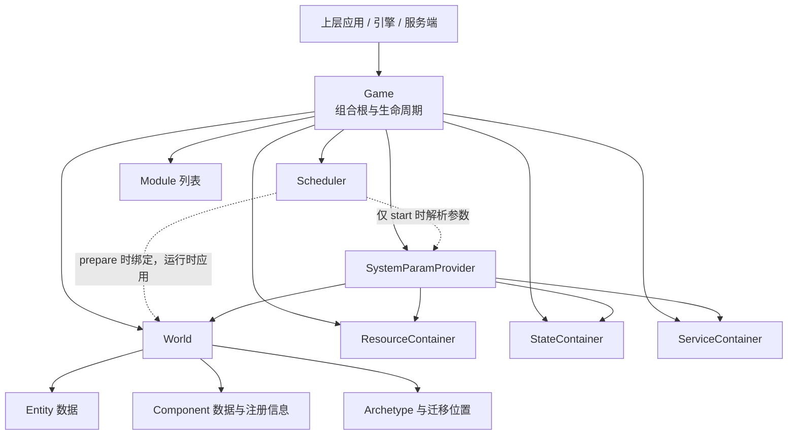
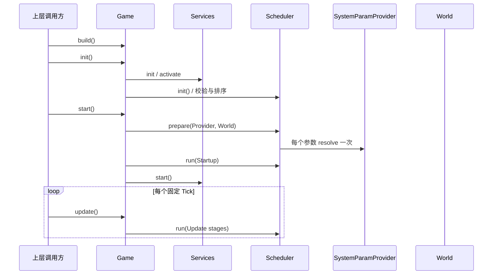

# Game / World 框架调整方案

> 状态：设计方案，尚未实施。
>
> 基线：以当前 `Ecs`、`World`、`Scheduler`、三个依赖容器和 Core ECS Service 的实现为准。
>
> 范围：只调整框架职责、所有权、依赖方向和生命周期时点；不重新设计 Entity、Component、Archetype、Query、Command、Migration、DataSet、Allocator 或对象池的实现。

## 1. 背景与结论

当前 `World` 不是实体世界，而是绑定 `InjectionContext` 后访问 Resource、State、Service 的门面；真正持有 World、三个容器、Scheduler、Module 和生命周期的是 `Ecs`。Scheduler 在 `init()` 中直接识别所有参数类型，从 `InjectionContext` 取得参数并缓存到 `RuntimeSystem.args`。

目标框架采用以下定义：

- `Game`：一个可独立运行的纯数据 ECS 模拟实例，是依赖注入、Module 和生命周期的组合根。
- `World`：纯实体数据集合，提供实体与组件的基础操作，不提供依赖注入和调度能力。
- `Scheduler`：应用于 World 的系统执行器，与 World 同级，不拥有 World。
- `SystemParamProvider`：Game 提供给 Scheduler 的系统参数来源接口；Scheduler 不依赖 Game、`InjectionContext` 或具体容器。
- System 参数在 `Game.start()` 中解析一次并缓存，任何 `update()` 都不得重新查询 Provider 或容器。

目标所有权如下：



所有权约束：

```text
Game owns World
Game owns Scheduler
Game owns DI containers and Modules
Scheduler does not own World
World does not own Scheduler
World does not know Game or DI
```

## 2. 当前代码基线

本方案依赖并保留以下现状。

### 2.1 当前所有权

`EcsBuilder.build()` 当前执行：

1. 创建并锁定 Resource、State、Service 容器。
2. 创建包含 World 和三个容器的 `InjectionContext`。
3. 将 Context 绑定给 World 与 `InjectionService`。
4. 为 State、Service 完成属性注入。
5. 从 `SystemScheduleBuilder` 构造 `Scheduler`。
6. 将上述对象交给 `Ecs` 统一管理生命周期。

当前 `Ecs` 与 `World` 都提供 `resource()`、`state()`、`service()`；World 的三个方法只是转发给 Context 中的容器。

### 2.2 当前 Scheduler 已经具备的性能特征

当前 Scheduler 不是每帧解析系统参数。`Scheduler.init(context)` 会：

1. 按 Stage 筛选 SystemDefinition。
2. 对同阶段系统执行稳定拓扑排序。
3. 调用 `resolveParam()` 解析每个参数。
4. 把参数冻结并保存为 `RuntimeSystem.args`。

`Scheduler.run()` 只遍历已排序的 RuntimeSystem，并使用 0 至 8 参数的固定调用分支；超过 8 个参数才使用 `apply()`。

因此本方案不重写运行热路径，只做两项框架调整：

- 参数解析时点由 `Ecs.init()` 移到 `Game.start()`，并保证在第一个 Startup System 前完成。
- 将 `Scheduler.resolveParam()` 中对 `InjectionContext` 和具体类型的识别移到 `SystemParamProvider`。

### 2.3 当前实体能力的物理位置

当前实体数据和操作分布在 Core ECS 的 State 与 Service 中：

| 当前对象 | 当前职责 | 目标框架中的归属 |
| --- | --- | --- |
| `ComponentRegistryState` / `ComponentService` | 组件注册和 World-local ID | World 实体内核 |
| `ArchetypeState` / `ArchetypeService` | Archetype 集合、索引和版本 | World 实体内核 |
| `EntityState` / `EntityService` | Entity slot、位置和基础实体操作 | World 实体内核 |
| `QueryService` | 将 QueryType 实例化为当前实体世界的 Query | World 实体能力；首轮保留现有实现 |
| `EcsMemoryService` | Allocator 生命周期 | 继续保留为 Service；本方案不调整 Allocator 实现 |
| `EntityMigrationService` | 合并并提交延迟结构事务 | 继续作为 Game 的内部 Service/System 能力 |
| Command/Event/Timer 等 | 延迟行为和功能设施 | Game 的 State、Service 和 System |

“目标归属”描述的是最终框架职责，不授权在首轮重写这些类的存储结构和算法。

## 3. 核心职责

### 3.1 Game

`Game` 替代当前 `Ecs` 的顶层定位，但它不是窗口、UI 或操作系统应用。上层应用可以同时拥有多个 Game，例如主模拟、预览模拟或服务端房间。

Game 负责：

- 构建并持有一个 World。
- 构建并持有一个 Scheduler。
- 持有 Resource、State、Service 容器。
- 提供依赖注入能力和 Service 生命周期上下文。
- 组装 `SystemParamProvider`。
- 管理 Module 及 init/start/update/stop/dispose 生命周期。
- 在 start 阶段让 Scheduler 对当前 World 完成一次性准备。

建议命名映射：

| 当前名称 | 目标名称 |
| --- | --- |
| `Ecs` | `Game` |
| `EcsBuilder` | `GameBuilder` |
| `EcsPhase` | `GamePhase` |
| `ECS_CONSTRUCTION_TOKEN` | `GAME_CONSTRUCTION_TOKEN`（内部） |

是否提供旧名称兼容层不属于本方案；实施前应单独确定发布策略。

### 3.2 World

World 是纯实体数据集合，只公开或承载以下能力：

- Entity 创建、销毁、有效性检查和位置管理。
- Component 注册信息与组件数据。
- Component 添加、删除、读取和修改。
- Entity 在 Archetype 之间的迁移。
- Archetype、Table、DataSet 和 Query 所需的实体元数据。
- 释放自身实体数据所需的清理能力。

World 不负责：

- Resource、State、Service 的访问或注入。
- Module 构建与生命周期。
- System 注册、排序和执行。
- Scheduler 所有权。
- Game 的 init/start/update/stop。
- DOM、Canvas、设备句柄等宿主能力。

当前下列入口应从目标 World 中移除：

```ts
World.inject();
world.resource(Type);
world.state(Type);
world.service(Type);
world.bind(injectionContext);
```

World 是否作为 System 参数继续存在，由 `SystemParamProvider` 按当前 SystemParam 规则提供；这不意味着 World 自己拥有 DI。

### 3.3 Scheduler

Scheduler 继续负责：

- SystemDefinition、Stage 和显式依赖关系。
- 稳定拓扑排序。
- `SystemAccess` 调度元数据。
- RuntimeStage、RuntimeSystem 与缓存参数数组。
- 当前串行执行策略和固定参数数量快速调用。

Scheduler 不再负责：

- 识别 Resource、State、Service、QueryType 等具体参数类别。
- 访问 `InjectionContext`。
- 查找具体容器。
- 管理 World 生命周期。

Scheduler 只是针对一个 World 完成准备并执行；它可以保存运行所需的非拥有引用，但 World 的所有权始终属于 Game。

### 3.4 SystemParamProvider

为保持当前实现细节，参数提供者只负责把现有 `SystemParam` 转换为当前运行值，不接管访问图构建，也不引入新的 Query、Commands 或参数包装模型。

最小接口可以是：

```ts
export interface SystemParamProvider {
    resolve(param: SystemParam, world: World): unknown;
}
```

默认实现由 Game 创建，并使用当前已有规则：

| System 参数 | 当前值来源 |
| --- | --- |
| `World` | Game 当前持有的 World |
| Resource 类型 | ResourceContainer |
| State 类型 | StateContainer |
| `Write(StateType)` | StateContainer 中相同的 State 实例 |
| Service 类型 | ServiceContainer |
| QueryType | 当前 `QueryService.create(QueryType)` |

`SystemScheduleBuilder.createAccess()` 继续使用当前逻辑生成 `SystemAccess`。参数提供者不重复推断 access，也不改变“权限只是调度元数据而非安全隔离”的现行规则。

## 4. 一次性参数准备与热路径

### 4.1 生命周期时点

目标时序：



`Scheduler.init()` 只完成不依赖 DI 的校验和排序，使依赖环仍能在初始化阶段尽早失败。`Scheduler.prepare()` 在 start 中解析参数并生成 RuntimeSystem；未 prepare、重复 prepare 或 prepare 失败后执行 System 都必须报错。

### 4.2 必须保留的性能约束

- 每个已注册 System 的每个参数在一个 Game 生命周期内只解析一次。
- `update()` 不得调用 `SystemParamProvider.resolve()`。
- `update()` 不得查询 Resource、State、Service 容器。
- `update()` 不得重新创建参数数组或 Read/Write 包装对象。
- QueryType 继续只在准备阶段通过当前 QueryService 创建一次 Query。
- RuntimeSystem 继续持有冻结的 args。
- 当前 0 至 8 参数的 `invoke()` 快速分支保持不变。
- Stage 顺序、Internal Post、异常停止语义保持不变。

若未来允许运行时添加 System，只能在明确的安全点为新增 System 单独 prepare；不得因此重新解析已有 System 参数。本项不在当前实施范围。

## 5. 基于现有代码的 World 迁移策略

World 的目标职责与当前物理实现差异较大，必须分阶段迁移，不能在一次框架改名中重写 ECS 内核。

### 5.1 第一阶段：建立纯 World 公共边界

第一阶段保留现有 Core ECS Service、State 和所有存储算法，World 通过内部适配委托现有能力：

| World 能力 | 首轮复用对象 |
| --- | --- |
| spawn/despawn/valid | `EntityService` |
| get/has/view/getTypes/getCompLocation | `EntityService` |
| Component 注册和定义 | `ComponentService` |
| Archetype 查找和迁移 | `ArchetypeService`、`EntityService.migrate()` |
| Query 创建 | `QueryService` |
| 延迟结构事务 | 保持 `CommandService` 与 `EntityMigrationService` 当前路径 |

该适配层必须是内部实现，不能让 World 重新公开 `service()` 或暴露整个 InjectionContext。World 对外只出现实体领域 API。

这一阶段不改变：

- Entity 编码、版本和退休规则。
- Component ID、Mask 与布局规则。
- Archetype 索引和 DataSet 结构。
- Table/Buffer/Allocator 层级。
- QueryType、Query、QueryIter 及其缓存失效规则。
- EntityCommand、MigrationPlan 和 Internal Post 提交顺序。

具体 World 方法签名应直接从现有 EntityService、ComponentService 和 QueryService 的稳定能力整理，不在本方案中创造新的 QueryHandle、QueryPlan 或存储抽象。

### 5.2 第二阶段：收敛物理所有权

第一阶段稳定并完成性能回归后，再单独评审是否将以下数据整体迁入 World 内部：

- `ComponentRegistryState` 的注册表。
- `ArchetypeState` 的集合、掩码索引和版本。
- `EntityState` 的 slots、位置、空闲索引和计数器。

这一步只改变对象归属，仍不得顺带改变 DataSet、Allocator、Archetype 或 Query 算法。`EcsMemoryService`、对象池和延迟事务 Service 是否调整，必须分别评审，不由本方案自动决定。

## 6. Game DI 与 World 的边界

依赖注入完全属于 Game：

- State、Service 的属性注入由 Game 构建流程完成。
- ServiceInitContext、ServiceActivateContext 继续由 Game 创建和限制生命周期。
- `InjectionService` 继续服务于当前动态对象注入场景。
- System 参数通过 Game 创建的 SystemParamProvider 解析。
- World 不注入对象，也不保存 `InjectionContext`。

当前 `InjectionContext` 可在首轮继续作为 Game 的内部记录，供现有 InjectionService 和生命周期上下文复用；Scheduler 不再导入它，World 也不再绑定它。后续可以再评审是否重命名为 `GameInjectionContext`，但重命名不是解除耦合的前置条件。

Module 继续是开放封闭边界：公开 Module 和必要 Service 契约，内部 State、Service、System 仍可不导出。Module 的 `build/init/start/stop/dispose` 参数随顶层类型改为 Game，但钩子语义和顺序不因本方案改变。

## 7. 序列化边界

World 纯粹化后，序列化概念应明确拆分：

```text
WorldSnapshot
├─ Entity 身份与有效性数据
├─ Component 数据
└─ 恢复 Archetype/位置关系所需的数据

GameSnapshot
├─ WorldSnapshot
└─ State 中显式标记为可序列化的字段
```

Resource、Service、System、Scheduler、Module、对象池和宿主句柄默认不进入快照。具体序列化装饰器和格式仍是延期设计，本方案只确定边界。

## 8. 分阶段实施顺序

### 阶段 A：Scheduler 依赖倒置

1. 增加最小 `SystemParamProvider` 接口。
2. 将当前 `Scheduler.resolveParam()` 原样迁入默认 Provider。
3. Scheduler 移除对 `InjectionContext`、三个容器和 QueryService 的直接导入。
4. 将排序/校验与参数 prepare 分离。
5. 在 start、Startup 前 prepare 一次；update 热路径保持不变。

### 阶段 B：Game 命名与组合根

1. 将 Ecs、EcsBuilder、EcsPhase 的目标语义迁移到 Game、GameBuilder、GamePhase。
2. Game 继续同级拥有 World、Scheduler、三个容器和 Module。
3. GameBuilder 构造默认 Provider 并交给 Game。
4. 保持现有 Service 和 Module 生命周期顺序。

### 阶段 C：World 公共职责调整

1. 移除 World 的 Resource/State/Service 门面职责。
2. 移除 World 对 InjectionContext 的绑定。
3. 通过内部适配复用当前 Core ECS Service，向 World 提供实体基础 API。
4. 保持 EntityCommand 和内部迁移提交路径不变。
5. 将 World 从 `context` 语义移动到 `ecs` 语义；具体目录移动可随导入整理完成。

### 阶段 D：物理所有权评审

1. 独立评审三个 Core State 是否整体并入 World。
2. 独立评审 EntityService 等是否保留为高层门面或转为 World 内部实现。
3. 独立评审序列化、复制、回滚所需的数据导出边界。

阶段 D 不是阶段 A 至 C 的附带重构，必须重新审核后实施。

## 9. 验收标准

框架迁移完成至少应满足：

- World 不再能够取得任意 Resource、State 或 Service。
- World 不持有 Scheduler，Scheduler 也不拥有 World。
- Scheduler 源码不依赖 `InjectionContext`、ResourceContainer、StateContainer、ServiceContainer 或 QueryService。
- Game 只通过 `SystemParamProvider` 为 Scheduler 提供参数。
- 每个参数在 start 中恰好解析一次；多次 update 不增加解析次数。
- System 参数值、Query 实例和 Service/State/Resource 引用与当前实现一致。
- RuntimeSystem args 缓存和 `invoke()` 快速路径保持不变。
- SystemAccess、before/after/chain、Stage 和 Internal Post 行为保持不变。
- Service 与 Module 生命周期顺序保持不变。
- 当前全部单元测试、包边界测试、示例类型检查和构建通过。
- 新增 World 独立测试、Provider 单次解析测试和 Scheduler 无 DI 依赖测试。

## 10. 明确不在本方案中的事项

- 不设计新的 Query 参数模型。
- 不引入 QueryHandle、QueryPlan 或每帧参数解析器。
- 不改变 Query 的遍历、缓存或返回结构。
- 不改变 Component 布局、Mask、Archetype 或 DataSet。
- 不改变 Allocator 和对象池设计。
- 不改变 Command/Event/Timer 的延迟执行语义。
- 不实现序列化装饰器。
- 不实现并行调度或新的访问冲突算法。
- 不因为 World 调整而强制删除现有 EntityService 或其他 Core Service。

这些内容如需调整，应分别建立设计文档和性能基线，不能混入本次框架迁移。
